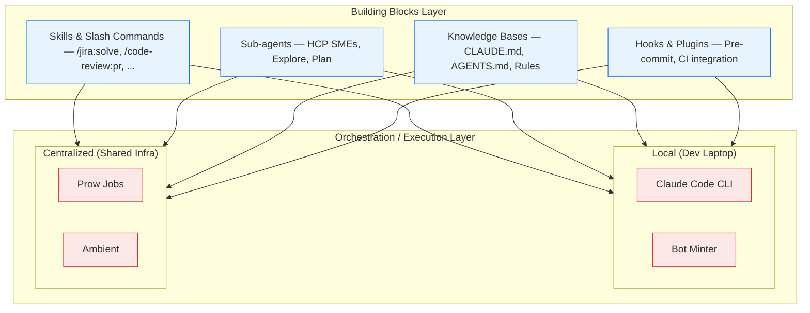
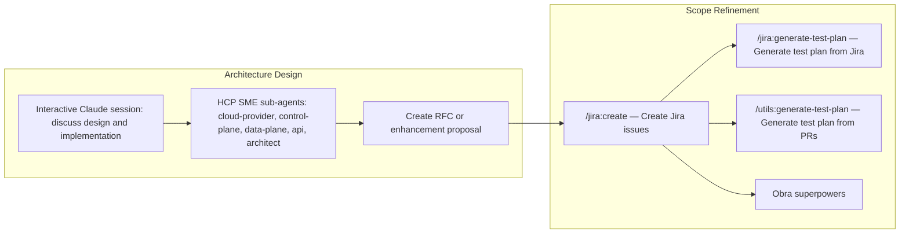
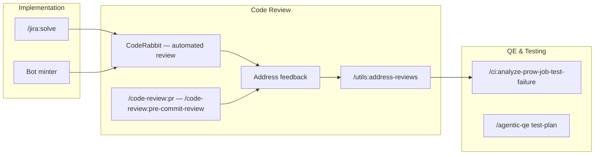
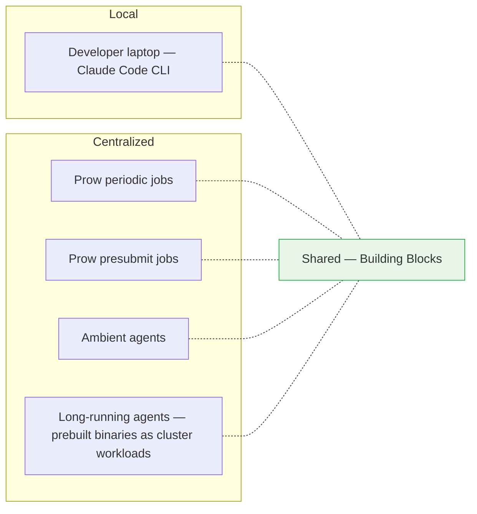
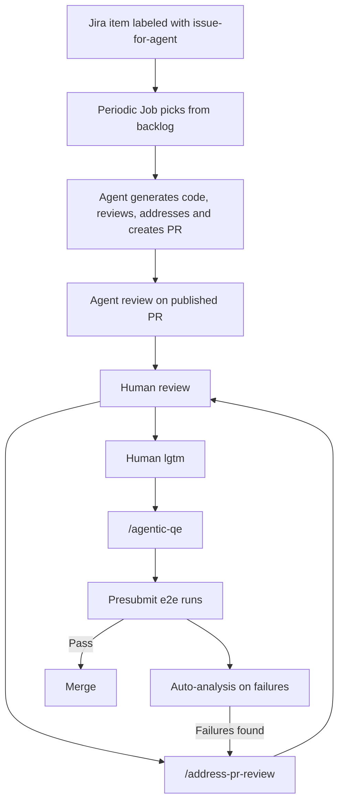

# Agentic Software Development Life Cycle

The HyperShift team operates an **Agentic Software Development Life Cycle (ASDLC)**. A framework that decouples distributed consumption of reusable agentic building blocks (skills, slash commands, sub-agents, knowledge bases) from the systems that orchestrate agent execution and LLM inference at scale.

This separation enables flexible implementation choices: the same building blocks power local Claude Code (or other agents) sessions that can run on a developer's laptop, centralized Prow CI jobs, ambient agents, long-running cluster workloads, etc.




---

## Phases of ASDLC

### Phase 1 — Discovery

The discovery phase focuses on understanding the problem space, designing the solution, and refining scope into actionable work items.




#### Architecture Design


| Activity          | Building Block                                 | Description                                                                                                              |
| ----------------- | ---------------------------------------------- | ------------------------------------------------------------------------------------------------------------------------ |
| Design discussion | Claude Code / Other Agents interactive session | Discuss design and implementation plans with Agents in a conversational session                                          |
| Domain expertise  | HCP SME sub-agents                             | Leverage specialized agents: `cloud-provider-sme`, `control-plane-sme`, `data-plane-sme`, `api-sme`, `hcp-architect-sme` |
| Proposal creation | RFC / Enhancement                              | Create a formal enhancement or RFC document capturing the agreed design                                                  |


#### Scope Refinement


| Activity             | Building Block              | Description                                                      |
| -------------------- | --------------------------- | ---------------------------------------------------------------- |
| Issue creation       | `/jira:create`              | Create well-structured Jira issues (stories, bugs, tasks, epics) |
| Test planning (Jira) | `/jira:generate-test-plan`  | Generate test steps from a Jira issue                            |
| Test planning (PRs)  | `/utils:generate-test-plan` | Generate test steps for one or more related PRs                  |


---

### Phase 2 — Delivery

The delivery phase covers implementation, review, and quality assurance — each supported by agentic workflows.




#### Implementation


| Activity        | Building Block | Description                                                         |
| --------------- | -------------- | ------------------------------------------------------------------- |
| Code generation | `/jira:solve`  | Analyze a Jira issue and create a pull request with a proposed fix  |
| Code generation | Bot minter     | GitHub App-based agents that create and manage PRs programmatically |


#### Code Review


| Activity          | Building Block                      | Description                                           |
| ----------------- | ----------------------------------- | ----------------------------------------------------- |
| Automated review  | [CodeRabbit](https://coderabbit.ai) | AI-powered code review bot running on every PR        |
| On-demand review  | `/code-review:pr`                   | Trigger a full PR review with language-aware analysis |
| Pre-commit review | `/code-review:pre-commit-review`    | Review staged changes before committing               |
| Address feedback  | `/utils:address-reviews`            | Automatically address PR review comments              |


#### QE & Testing


| Activity                | Building Block                      | Description                                                     |
| ----------------------- | ----------------------------------- | --------------------------------------------------------------- |
| CI failure analysis     | `/ci:analyze-prow-job-test-failure` | Analyze test failures from Prow CI job artifacts                |
| Agentic QE              | `/agentic-qe test-plan`             | Execute test plans with agentic workflows                       |
| Presubmit auto-analysis | Prow presubmits                     | CI jobs automatically trigger failure analysis on test failures |


---

## Modes of Agentic Workflows

A mode describes where/how execution happens. Building blocks can be executed in different modes depending on the use case:




### Local

Building blocks executed by developers on their laptops using Claude Code CLI, Bot-Minter, others... This is the most interactive mode where removing ambiguity might need several iterations. Ideal for design discussions, exploratory work, and ad-hoc tasks.

Before publishing a code artifact for human review, developers are expected to levereage building blocks for local code review and agentic qe

### Centralized

Building blocks run and driven by central infrastructure tools. These run on schedule, in response to events, or continuously as cluster workloads: Prow Jobs, Ambient, Cluster workloads... Ideal for repetitive tasks or concise work items.

#### Hands-off Delivery




For details on the current centralized jobs, see [AI-Assisted CI Jobs](https://hypershift.pages.dev/how-to/ci/ai-assisted-ci-jobs/).

---

## Monitoring

### Dashboards

[Agent execution metrics, token usage, and cost tracking](https://dashboard-jira-agent-dashboard.apps.jira-agent-scraper.brcox.hypershift.devcluster.openshift.com/)

### Slack Integration


| Channel               | Purpose                                         |
| --------------------- | ----------------------------------------------- |
| `@ship-help`          | AI-assisted triage and routing of help requests |
| `#project-hypershift` | General team channel                            |


Building blocks integrate with Slack for notifications, status updates, and interactive assistance.

---

## Principles

- **Reuse drives self-improvement** — Every execution of a building block generates signal (successes, failures, review feedback) that feeds back into refining the building blocks themselves.
- **Raise the quality floor** — Agentic workflows must enforce consistent code patterns, code review, test generation, and CI analysis on every change, raising the baseline quality across all contributions.
- **Compounding returns** — Better building block specifications produce better output, which produces better input data for the next iteration. The system improves itself over time.

---

## Getting Started

=== "For developers"

    1. Install [Claude Code CLI](https://docs.anthropic.com/en/docs/claude-code/getting-started)
    2. Clone the HyperShift repository
    3. Install plugins:

    ```bash
    /plugin marketplace add openshift-eng/ai-helpers
    /plugin install jira@ai-helpers
    /plugin install utils@ai-helpers
    /plugin install ci@ai-helpers
    /plugin install code-review@ai-helpers
    ```

=== "For CI integration"

    1. See [AI-Assisted CI Jobs](https://hypershift.pages.dev/how-to/ci/ai-assisted-ci-jobs/) for existing Prow job setup
    2. Label Jira issues with `issue-for-agent` to submit them for processing

